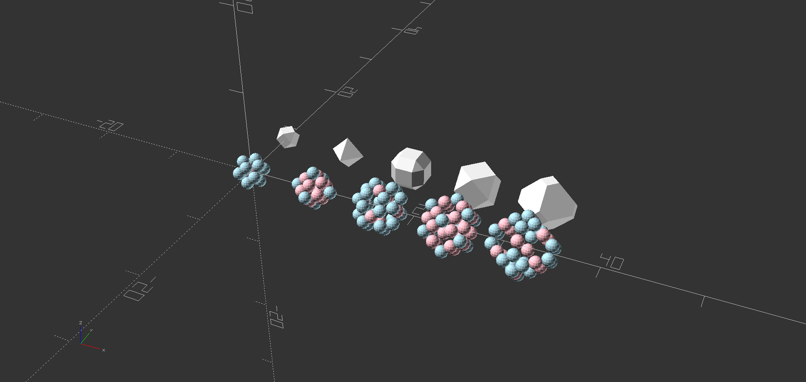
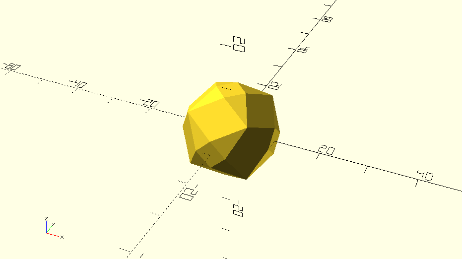

# Waterman
Waterman Polyhedra library for OpenSCAD

This is a library for generating Waterman Polyhedra like http://paulbourke.net/geometry/waterman/



## Usage

```
cd <openscad folder>/libraries/
git clone https://github.com/Sekenre/Waterman.git
```

demo.scad:

```
use <Waterman/waterman.scad>;

scale(10) scaled_waterman(6);
```



### Modules

* `waterman(root)` Render the polyhedron (unscaled, aligns with grid of integer coordinates)

* `scaled_waterman(root)` Polyhedron scaled to fit within a bounding box with side length = 2 centred at the origin

* `waterman_spheres(root, draw_inner=false)` Draw the spheres that make up the interior of the polyhedron. The outermost layer of spheres is highlighted in blue.

